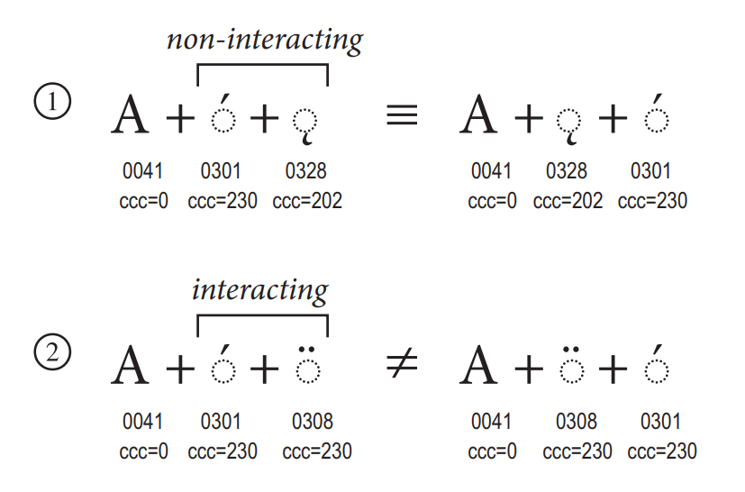

**中文 (简体，中国)** <br/>~~中文 (繁體，中國)~~ <sub>中文 (繁体，中国)</sub><br/>~~English (The United States)~~ <sub>英文 (美国)</sub>

此 Python 包可用于处理拉丁文本标准化问题。

# 〇、使用方法

## 1. 整体调用

```python
import latin-normalize
```

整体调用要求调用时 `latin-normalize` 文件夹必须位于正在调用的文件的同级目录。

若 `latin-normalize` 不在同级目录，而是在目录 `<some_path>` 中，则需要按照以下方式调用：

```python
import sys
sys.path.append(r'<some_path>')
import latin-normalize
```

使用函数或其他内容时，如是操作：

```python
latin-normalize.getClass('A')
```


## 2. 部分调用

```python
# 调用所有
from latin-normalize import *
# 调用个别
from latin-normalize import getClass, getCode
```

部分调用要求调用时 `latin-normalize` 文件夹必须位于正在调用的文件的同级目录。

若 `latin-normalize` 不在同级目录，而是在目录 `<some_path>` 中，则需要按照以下方式调用。

```python
import sys
sys.path.append(r'<some_path>')
# 调用所有
from latin-normalize import *
# 调用个别
from latin-normalize import getClass, getCode
```

使用函数或其他内容时，如是操作：

```python
getClass('A')
getCode('B')
```

# 一、字符的规范组合类信息

规范组合类用于指示附标字符附加到基础字符上的优先级。其中规范组合类为 0 的是基本字符，大于 0 的是附标字符。

规范组合类的范围在 0~255 之间。用于描述不相干附标符号的优先级。相干附标符号优先级由附标符号与基本字符之间的距离决定，近者优先。



<center><small>图 1 规范排序<br/>（图源 <a href="https://www.unicode.org/versions/Unicode15.0.0/UnicodeStandard-15.0.pdf">Unicode 15.0 标准文档</a>）</small></center>

## 相关函数

1. `getClass(x)`

`getClass` 函数用于返回字符规范组合类的文字信息。返回 `str` 类型。参数 `x` 需为 `str` 类型，且 `len(x)` 必须为 1。

```python
getClass('\u0308')
# 'Above'

getClass('\u0328')
# 'AttachedBelow'
```

2. `getCode(x)`

`getCode` 函数用于返回字符规范组合类的数字编码信息。返回 `int` 类型。参数 `x` 需为 `str` 类型，且 `len(x)` 必须为 1。

```python
getCode('\u0308')
# 230

getCode('\u0328')
# 202
```

# 二、字符编码信息

## 相关函数

3. `getU32(x)`

`getU32` 函数用于返回字符的十六进制 Unicode 编码。其中不满四位的左侧用 "0" 补满。返回值为大写，`str` 类型。参数 `x` 需为 `str` 类型，且 `len(x)` 必须为 1。

```python
getU32('\u0308')
# '0308'

getU32('\u0328')
# '0328'

getU32('\U0002e9f5')
# '2E9F5'

getU32('我')
# '6211'

getU32('あ')
# '3042'

getU32('한')
# 'D55C'
```

4. `getU32_dec(x)`

`getU32_dec` 函数用于返回字符的十进制 Unicode 编码。返回值为 `int` 类型。参数 `x` 需为 `str` 类型，且 `len(x)` 必须为 1。

```python
getU32_dec('\u0308')
# 776

getU32_dec('\u0328')
# 808

getU32_dec('\U0002e9f5')
# 190965

getU32_dec('我')
# 25105

getU32_dec('あ')
# 12354

getU32_dec('한')
# 54620
```

5. `parseU32(u32)`

`parseU32` 函数用于返回十六进制 Unicode 编码对应的字符。返回值为 `str` 类型。参数 `x` 需为 `str` 类型，且为有效十六进制字符串。

```python
parseU32('6211')
# '我'

parseU32('3042')
# 'あ'

parseU32('D55C')
# '한'
```

# 三、拉丁字母规范组合处理

## 相关函数

6. `splitText(text)`

`splitText` 函数可将字符串以基本字符及其附标符号为单位分组，以 `list` 形式返回。参数`text` 为 `str` 类型，长度不限。

```python
splitText('Tie\u0302\u0301ng Vie\u0302\u0323t')
# ['T', 'i', 'ế', 'n', 'g', ' ', 'V', 'i', 'ệ', 't']

splitText('u\u0308\u0304u\u0304\u0308')
# ['ǖ', 'ṻ']
```

7. `apart(x)`

`apart` 函数可将一个带附标的字母例如“ǖ”（U+01D6）拆解为基本字母和附标字母的组合字符串。返回值为 `str` 类型。参数 `x` 需为 `str` 类型，且 `len(x)` 必须为 1。

```python
apart('\u01d6')
# 'ǖ'
list(apart('\u01d6'))
# ['u', '̈', '̄']

apart('\u1ebf')
# 'ế'
list(apart('\u1ebf'))
# ['e', '̂', '́']
```

8. `join(text)`

`join` 函数可将一组完整的1个基本字母及其附标符号的组合尽可能地按顺序组合起来。

```python
join('o\u0308\u0328')
# 'ǫ̈'
list(join('o\u0308\u0328'))
# ['ö', '̨']

join('o\u0328\u0308')
# 'ǫ̈'
list(join('o\u0328\u0308'))
# ['ǫ', '̈']

join('e\u0302\u0301')
# 'ế'

list(join('e\u0302\u0301'))
# ['ế']
```

9. `sort(text, toList=False)`

`sort` 函数可将任意长字符串分组并逐组按规范排序。`text` 为任意长字符串；`toList` 为可选参数，类型为 `bool`，默认为 `False`。默认情况下，结果以 `str` 形式输出；当 `toList == True` 时，结果以 `list` 形式输出。

```python
sort('Tie\u0302\u0301ng Vie\u0302\u0323t')
# 'Tiếng Việt'

sort('Tie\u0302\u0301ng Vie\u0302\u0323t', True)
# ['T', 'i', 'ế', 'n', 'g', ' ', 'V', 'i', 'ệ', 't']
```

10. `normalize(text, toList=False)`

`normalize` 函数可将任意长字符串分组并逐组按规范排序，最后将可组合的基本字母与附标符号组合。`text` 为任意长字符串；`toList` 为可选参数，类型为 `bool`，默认为 `False`。默认情况下，结果以 `str` 形式输出；当 `toList == True` 时，结果以 `list` 形式输出。

```python
normalize('Tie\u0302\u0301ng Vie\u0302\u0323t')
# 'Tiếng Việt'
list(normalize('Tie\u0302\u0301ng Vie\u0302\u0323t'))
# ['T', 'i', 'ế', 'n', 'g', ' ', 'V', 'i', 'ệ', 't']

normalize('E\u0302E\u0302\u0304E\u0302\u0301E\u0302\u030cE\u0302\u0300')
# 'ÊÊ̄ẾÊ̌Ề'
list(normalize('E\u0302E\u0302\u0304E\u0302\u0301E\u0302\u030cE\u0302\u0300'))
# ['Ê', 'Ê', '̄', 'Ế', 'Ê', '̌', 'Ề']

normalize('E\u0302E\u0302\u0304E\u0302\u0301E\u0302\u030cE\u0302\u0300', True)
# ['Ê', 'Ê̄', 'Ế', 'Ê̌', 'Ề']
```

